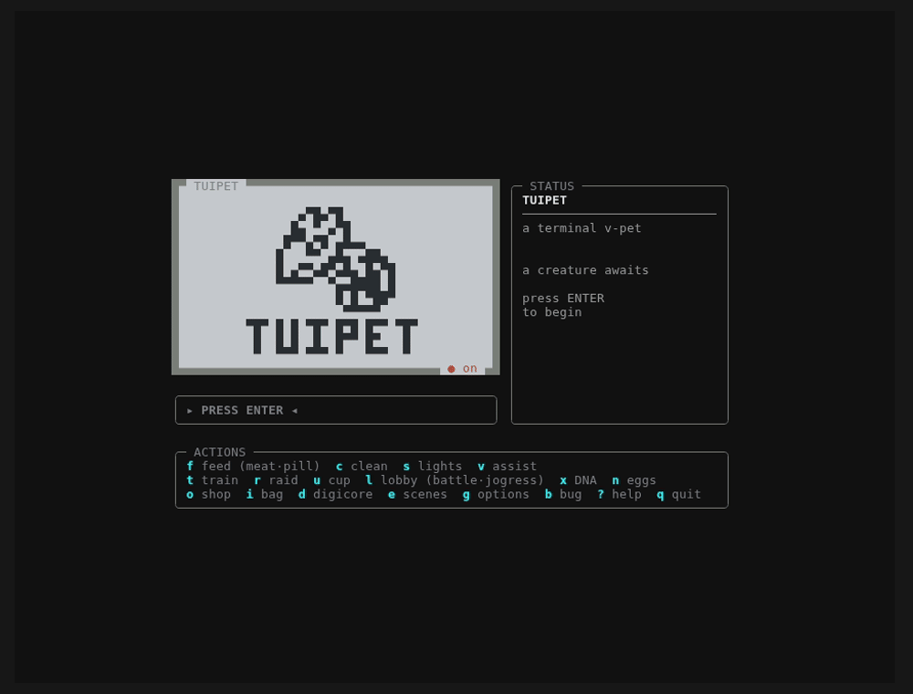

# tuipet

A terminal virtual pet — Digimon V-Pet style — rendered with halfblock Unicode
sprites and animated in the terminal. It builds on the work of the Digimon V-Pet
fan community — see [Credits & acknowledgments](#credits--acknowledgments).



**Status: live and actively developed.** tuipet is its own game: the core
V-Pet behaviour — every mechanic, animation, and evolution line — is built
on and verified against the real devices, with data cross-referenced against
community references. Regular updates ship as the game grows.

## What's inside

- **1,548 creatures**, 11 animation frames each, extracted from the game's
  sprite atlases as 1-bit bitmaps (`src/tuipet/data/sprites.json.gz`).
- A **complete Digimon V-Pet**, every system faithful to the real devices:
  care, training, evolution (care-quality gates + DNA + jogress),
  adventures across 5 world maps, hourly tournaments, town economies,
  habitats with live climate/weather, an in-game AI care assistant, and the
  device's own screen transitions and animation timelines.
- **Online play** tuipet adds on top: accounts with cloud saves that follow
  you across devices, and a live lobby with chat, PvP battles, and two-player
  jogress fusion.
- A `rich`/`textual` UI: a fixed LCD arena with the animated pet, a live
  status card, and a one-line control strip — every screen lives in the box.

## Install

**Requires Python 3.10+.**

**One command:**

```sh
pip install tuipet && tuipet
```

Or with pipx / uv (isolated):

```sh
pipx install tuipet      # then: tuipet
uvx tuipet               # run without installing
```

Every sprite, sound, and CSV is bundled in the package — nothing else to download.

**On Termux (Android):** first `pkg install python`, then `pip install tuipet`. To
actually hear the LCD beeps you also need the **termux-api** package
(`pkg install termux-api`) *and* the **Termux:API** app from F-Droid/Play — the
package alone isn't enough: it installs a *bridge* that only works when the app
is there. Missing the app, tuipet detects that and falls back to the terminal
bell (Options → sound then reads *bell only*), so a silent install tells you
what's wrong instead of just being quiet. Over SSH, sound stays silent on purpose. The
`curl -fsSL https://raw.githubusercontent.com/joeltco/tuipet/main/install.sh | bash`
script does all of that in one shot.

**On iPhone / iPad — use [a-Shell](https://holzschu.github.io/a-Shell_iOS/)
(the supported iOS way):** a-Shell is a free, open-source terminal on the App
Store that ships Python 3.11 — everything tuipet needs.

```sh
pip install tuipet
python3 -m tuipet
```

Use `python3 -m tuipet` rather than the bare `tuipet` command: a-Shell installs
console scripts somewhere `PATH` doesn't always look, and the module launch
always works. Tap the **⌨ key row** above the keyboard for `Esc` and the arrow
keys. Turn your phone to landscape (or drop the font size in a-Shell's settings)
if the panels wrap.

Two iOS notes, both handled for you:

* **Saves.** iOS forbids writing to `~`, so tuipet keeps your pet in
  `~/Documents/tuipet/` there instead of the usual `~/.local/share/tuipet/`. That
  folder is visible in the Files app, so your pet is backup-able and AirDrop-able.
  Set `TUIPET_SAVE_DIR` to put it anywhere you like.
* **Sound.** iOS sandboxes audio players, so tuipet falls back to the terminal
  bell (Options → sound shows *bell only*). Everything else — the lobby, battles,
  jogress, adventures — works exactly as it does everywhere else.

**On iSH:** iSH's Alpine usually ships a Python older than 3.10, so
`pip install tuipet` fails with *"No matching distribution found"*. Prefer
**a-Shell** above — it's the smoother iOS experience.

## Run from source

```sh
python -m venv .venv && . .venv/bin/activate
pip install -e .
tuipet           # or: PYTHONPATH=src python -m tuipet.app
```

Start from an **egg** — real dot-matrix egg designs; it wobbles, cracks, and hatches.

## Keys

| key | screen | key | screen |
|-----|--------|-----|--------|
| **f** | feed | **u** | tournament cup |
| **t** | train | **x** | DNA |
| **p** | play | **d** | DigiCore |
| **c** | clean | **e** | habitat |
| **h** | heal | **l** | online lobby |
| **r** | praise | **v** | AI assistant |
| **k** | scold | **g** | options |
| **a** | adventure | **s** | lights |
| **o** | shop | **i** | bag |
| **b** | bug report | **?** | help |
| **n** | digitama guide | **q** | quit |

Battles and jogress live where they belong: **PvE combat happens in
adventures and cups; PvP battles and fusion happen in the lobby** — there is
no free-standing battle key.

## Care & evolution

Evolution uses the real V-Pet gating model: each form's
`digimon.csv` row gates on care **mistakes**, **overfeed**, **sleep
disturbances**, **sickness**, **injuries**, **weight** class, **mood**,
**attribute power** (Vaccine/Data/Virus), and **battles/wins**, with the
game's exact fulfilled-requirement scoring and deviation tiebreak. Per-stage
counters reset on evolution; power and battle records carry for life.
Good care with focused training walks the classic lines; neglect finds
Numemon. Battle-gated Champions and above need real fights — adventures and
cups feed the same record.

**Training** (`t`) is the device's four drills — HP, Vaccine, Data, Virus —
each fought against an on-screen opponent: the punching bag, or for Data
your sparring partner in the real DM20 **versus training** (fire high or
low past their shield, 3 rounds of 5) — flowing into the canonical
strike → impact → aftermath, raising effort and the drilled attribute power.

**DNA** (`x`) is the per-Field collectible layer: charge banked Field-DNA
into the pet to bend evolution toward gated forms, generate more, and read
any form's requirements. Charging one Field to its stage threshold **arms a
divergence**: the next evolution leaves the egg's chart for the evolution
graph's road in that Field — the door that makes the *entire* 1,500+ roster
raisable. The DNA screen's Divergence page maps where each Field can take
you; the DigiCore counts your album toward the full collection. **Jogress** (two-player DNA fusion) happens in the
lobby with a real partner — the partner's attribute picks the fusion via the
game's `attributeJogress` matrix.

**DigiCore** (`d`) is the canon EvolutionState page: the field-flavoured core,
the countdown to the next growth, and the blacked-out silhouette teaser of
what's coming — plus tuipet's own data-book pages.

## Adventure

Press **a** to teleport into the Digital World — the striped curtain wipe is
the device's own `Teleport_Leave/Arrive` animation. **5 maps, 26 zones, 26
towns, 27 zone bosses, 462 enemy placements**, all at their real steps from
`zones.csv`/`towns.csv`/`enemies.csv`. The terrain shifts underfoot as you
walk (the zone's real background bands, cross-faded), wild encounters roll at
the game's real compound odds (night runs 1.5×), towns rest you and open
their **local shops and cups**, investigations gamble a zone-pool find
against an ambush, and each boss gates the road. Losses cost adventure life;
out of life, the pet retreats to the nearest town. Wins pay bits, roll the
enemy's real **loot table** (drops unlock shop listings for good), and grow
your power in the *enemy's* dominant attribute. The status card carries a
live **zone ribbon** — towns, the boss, and your pet on one track. Clear a
map to unlock the next region; transport items warp you around the world.

## Tournaments

Press **u** for the cup page: a **24-slot hourly schedule** rolled daily from
the season's 325 cups — only the current hour's cup takes entries, age tiers
and prelim chains gate the brackets, and an alarm can call you for a slot.
Each cup is the 8-entrant single-elimination bracket (Quarterfinal →
Semifinal → Final) with real rolled entrants; the other pairs auto-resolve
between your rounds. Titles pay the canonical purse, count trophies, and gate
tournament egg unlocks. Towns host their own cups on the road.

## Online

Press **l** for the lobby (accounts are free — pick a name and password).
Live **chat** with backlog, presence, private messages, **PvP battles**
(host-authoritative, with the full round-replay animation), and two-player
**jogress fusion**. Your save syncs to the cloud on the same account and
follows you across devices — last-write-wins with session leases, so a phone
left running can't clobber your desktop. Offline play is untouched; the
network is fail-soft everywhere.

## Habitats & weather

Press **e** to browse and buy homes — 16 habitats, previewed live as scenes.
Each has its own climate (seasonal temperature bands, precipitation, day/night
skies) that feeds mood, compatibility, and habitat-gated evolutions. On the
road, the pet's habitat follows the terrain it walks.

## Shop, bag & economy

**o** buys (home stock from the game's shop tables; towns override prices and
inventory with their own economies), **i** uses what you own. Foods, medicine,
discipline books, attribute chips, transport items, and the adventure **Life
Recovery** potion all carry their real in-game effects. Loot drops unlock
their shop listings permanently.

New **egg licenses** are earned, not handed out: you begin with the five classic
babies and unlock the rest by reaching stages, clearing region bosses, and growing
your album — common eggs stock the home shop, the rarest are exclusive to their
biome's town.

## AI assistant & options

**v** hires the device's auto-care AI (per-stage retainer and per-care fees —
it minds the pet, at a price, and never works while the pet is away
adventuring). **g** opens options: account switching, sound backend, update
check, key reference, theme, and the new-game/erase controls.

## Saving

Automatic — local save every 10 seconds and on quit, with backup generation
and offline catch-up decay (bounded; never evolves or dies while closed).
With an account, the same save syncs to the cloud in the background.

## Asset pipeline

Raw game files live under `_extract/` (gitignored). Re-extract with:

```sh
python tools/extract_sprites.py     # rebuilds data/sprites.json.gz
python tools/preview.py Agumon      # preview a creature as halfblocks
python tools/allframes.py Agumon    # see all 11 frames
```

The atlases are 672×672, an 11×11 grid: each **column** is one creature, each of
the 11 **rows** is an animation frame. Creatures are authored at 3× scale on a
cyan LCD background; the extractor box-downsamples 3× (recovering native 16px
sprites and dropping the dev-build column labels) and thresholds to 1-bit.

## Sprite frame convention

Each creature's 11-frame strip uses a fixed pose order, reverse-engineered from
the game's own `View/SpriteAnim.class` (cfr-decompiled). Animations in
`src/tuipet/data.py::ROLES` mirror the game's `cheer`/`jeer`/`eat`/`idleSleep`/etc.

| idx | pose                          | used by                          |
|-----|-------------------------------|----------------------------------|
| 0   | idle / walk A                 | idle bob (0,1), walk             |
| 1   | idle / walk B                 | idle bob, play, tantrum          |
| 2   | sleep / rest A                | `idleSleep` (2,3), wake stretch  |
| 3   | sleep / rest B                | `idleSleep`                      |
| 4   | angry / refuse / attack       | jeer, refuse head-shake, battle  |
| 5   | happy / cheer-up              | cheer (good), play               |
| 6   | sad / unhappy                 | jeer (bad), tantrum, attack      |
| 7   | eat-closed (chew) / cheer-down| eat (8↔7), heal, cheer           |
| 8   | eat-open (mouth) / neutral    | eat, heal, default expression    |
| 9   | tired / sick / disliked / old | fatigue idle, geriatric, dislike |
| 10  | exhausted (very tired)        | deep-fatigue idle                |

`refuse` is drawn as a left/right mirror flip on alternating frames (head-shake).

## Credits & acknowledgments

tuipet stands on the shoulders of the **Digimon V-Pet fan community** — a whole
ecosystem of hobbyists who reverse-engineered, documented, and preserved these
devices. It draws on the work of many of them, including:

- **[DVPet](https://theundersigned.itch.io/dvpet)** by *theundersigned* —
  tuipet began as a study of this fan game, and its sprite bank and early
  data came from it.
- **[humulos.com/digimon](https://humulos.com/digimon)** — device evolution,
  egg, and roster documentation used to build and verify the lines.
- **MultiVPet** and **Digimon Unlimited** — community sprite/stat extractions
  cross-referenced during development.
- the wider V-Pet preservation scene whose archives made any of this possible.

Sincere thanks to every one of these creators and archivists — none of this
would exist without your work.

The **Digimon** franchise and all creature names, designs, and sprites are
© **Bandai**. tuipet is a **non-commercial fan project**, not affiliated with or
endorsed by Bandai or any project listed above.

**Are you one of these creators?** If you'd like different credit, a link added,
or your work removed, open an issue (or reach me) and I'll take care of it right
away — no hard feelings.
