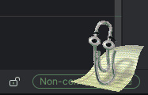
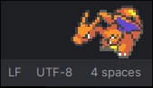

# Bongo Cat + V-Pets Wayland Overlay

[](https://opensource.org/licenses/MIT)
[](https://github.com/furudbat/wayland-vpets/releases)
[](https://github.com/furudbat/wayland-vpets/actions/workflows/release.yml)

A passive Wayland overlay that puts an animated pet on your screen, reacting to your keyboard in real time. 
Whether you're a Hyprland ricer chasing the perfect setup or just want Clippy watching you write code at 2am, this is the widget your dotfiles are missing.


  
_Classic Bongocat_

  
_Digimon V-Pets_

  
_Clippy_

  
_Pokemon_

## Features

- **🐈 Pets**
  - Bongocat 😺
  - Digimon V-Pets 🦖
  - Clippy 📎
  - Pokémon 🐭
  - Custom sprite sheets 🎨
- 🎯 Real-time keyboard animation
- 🔥 Hot-reload configuration
- 🎮 Auto-hides in fullscreen apps
- 🖥️ Multi-monitor support
- 😴 Idle & scheduled sleep mode
- 😄 Happy animation triggered by KPM threshold
- 🎲 Randomize sprite on startup
- 🔲 React to CPU usage
- ↔️ Movement on screen
- ⚡ Lightweight (~8MB RAM)
- 💗 Evolution (Digimon & Pokémon grow over time)


## Quick Start

### Install

```bash
# Arch Linux - latest release
yay -S wpets

# Arch Linux - latest commits
yay -S wpets-git
```

For other distros, see [Building](#building).

### Setup Permissions

```bash
sudo usermod -a -G input $USER
# Log out and back in
```

### Find Your Keyboard

```bash
wpets-find-devices  # or ./scripts/find_input_devices.sh
```

### Run

```bash
wpets-all --watch-config
# Optional: force a specific monitor
wpets-all --watch-config --monitor DP-1
```

## Configuration

Save to `~/.config/bongocat/bongocat.conf`:

```ini
# Bongo Cat Configuration File
# Edit these values to customize your bongo cat overlay

# Save this file to: ~/.config/bongocat/bongocat.conf
# Run with: wpets-all --watch-config --config ~/.config/bongocat/bongocat.conf

# Position & Size
cat_height=80
cat_align=center
# cat_x_offset=0
# cat_y_offset=0

# Appearance
enable_antialiasing=1
overlay_height=80
overlay_opacity=0
overlay_position=bottom
# mirror_x=0
# mirror_y=0

# Input device (run wpet-find-devices to find yours)
keyboard_device=/dev/input/event4

# Multi-monitor (optional - auto-detects by default)
# monitor=HDMI-A-1

# Sleep mode (optional)
# idle_sleep_timeout=300
# enable_scheduled_sleep=0
# sleep_begin=22:00
# sleep_end=06:00
```


For the full options reference, sprite list, evolution, and custom sprite sheet docs, see **[docs/configuration.md](docs/configuration.md)**.

## Usage Examples

```bash
wpets-all --watch-config --config ~/.config/bongocat/bongocat.conf
wpets-all --watch-config --config ~/.config/bongocat/digimon.bongocat.conf
wpets-all --watch-config --config ~/.config/bongocat/clippy.bongocat.conf
wpets-pkmn --watch-config --config ~/.config/bongocat/pmd.bongocat.conf
wpets-ms-agent --watch-config --config ~/.config/bongocat/rover.bongocat.conf
```

> `wpets` is the minimal binary. `wpets-all` bundles most sprites and is the recommended default.

For CLI flags, Hyprland autostart, ricing tips, and more config examples, see **[docs/usage.md](docs/usage.md)**.

## Troubleshooting

<details>
<summary>Permission denied on input device</summary>

```bash
sudo usermod -a -G input $USER
# Then log out and back in
```

</details>

<details>
<summary>Cat not responding to keyboard</summary>

1. Run `wpets-find-devices` to find correct device
2. Update `keyboard_device` in config
3. Restart bongocat

</details>

<details>
<summary>Not showing on correct monitor</summary>

Add `monitor=YOUR_MONITOR` to config. Find monitor names with `wlr-randr` or `hyprctl monitors`.

</details>
<details>
<summary>Pet hidden behind waybar</summary>

Both run on the same Wayland layer. Delay startup: `exec-once = sleep 5 && wpets-all ...`

</details>


## Building

```bash
git clone https://github.com/furudbat/wayland-vpets.git
cd wayland-vpets
cmake -S . -B build -DCMAKE_BUILD_TYPE=Release
cmake --build build
```

**Requirements:** wayland-client, gcc15 or clang19, make, cmake

> [!CAUTION]
> **Privacy Notice**: When building in `DEBUG` mode and by enabling `enable_debug=1`, all keystrokes are logged to stdout/stderr. Ensure this is disabled (default: 0) for normal usage.

### Installation from source

```bash
git clone https://github.com/furudbat/wayland-vpets.git
cd wayland-vpets
cmake -S . -B build -DCMAKE_BUILD_TYPE=Release
cmake --build build
sudo cmake --install build
```

> ⚠️ If you already have [bongocat](https://github.com/saatvik333/wayland-bongocat) installed, system-wide install may conflict.

## License

MIT License - see [LICENSE](LICENSE)