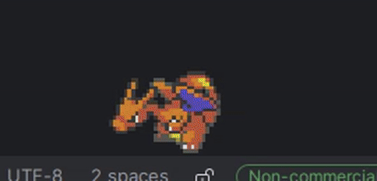

# Copyright

## Bongocat

custom-drawn bongo cat artwork by [@Shreyabardia](https://github.com/Shreyabardia)

## Neko

Old [Neko](https://github.com/eliot-akira/neko/tree/main) cat screenmate.
Part of the oneko-2.0, created by Tatsuya Kato.

Oneko-2.0 is based on xneko created by Masayuki Koba,
and image files of xneko is based on nekoDA created by Kenji Gotoh.

For more information, see following pages:  
http://www.3bit.co.jp/~sasaki/oneko/COPYRIGHTS  
http://en.wikipedia.org/wiki/Neko_(computer_program)  

## 3rd Party

This project is **free**, **non-commercial** and is not associated with the entities below.

### Digimon

Digimon and all related characters, and associated images are owned by Bandai Co., Ltd, Akiyoshi Hongo, and Toei Animation Co., Ltd.

**Evolution Data**
- [`dm`](https://humulos.com/digimon/dm/)
- [`pen`](https://humulos.com/digimon/pen/)
- [`dm20`](https://humulos.com/digimon/dm20/)
- [`pen20`](https://humulos.com/digimon/pen20/)
- [`dmx`](https://humulos.com/digimon/dmx/)
- [`dmc`](https://humulos.com/digimon/dmc/)
- https://wikimon.net/

### Pokemon

Pokemon sprite- and images are owned by Nintendo, Creatures Inc. and GAME FREAK Inc.

**Evolution Data**
- [`pkmn`](https://github.com/pokeapi/pokeapi) - just run it locally

#### PMD

https://github.com/PMDCollab/SpriteCollab

All custom graphics in this repository not originating from official PMD games are licensed under [Creative Commons Attribution-NonCommercial 4.0 International](https://creativecommons.org/licenses/by-nc/4.0/). Usage of the assets in this repository is subject to the terms of the license.

**Evolution Data**
- [`pmd`](https://github.com/pokeapi/pokeapi) - just run it locally

[FULL CREDIT SEE HERE](PMD_CREDITS.txt)

### MS Agent (Clippy)

Clippy and other MS Agents are owed by Microsoft.

## Special Thanks

- [humulos](https://www.youtube.com/channel/UCVx-uPYR8xyax_tHJjFddhw) and [Digitama Hatchery](https://humulos.com/digimon/) 
- [Wikimon](https://wikimon.net/) 
- [Airshuffler](https://www.spriters-resource.com/submitter/airshuffler/) - digimon v-pet sprites
- [Tortoiseshel](https://withthewill.net/threads/full-color-digimon-dot-sprites.25843/) - colored digimon sprites
- [Siul](https://www.spriters-resource.com/pc_computer/microsoftofficexp/sheet/104487/) - MS agent sprites
- https://github.com/msikma/pokesprite
- [bulbagarden Wiki](https://archives.bulbagarden.net/wiki/Category:Animated_menu_sprites)
- [pokeapi](https://pokeapi.co/)
